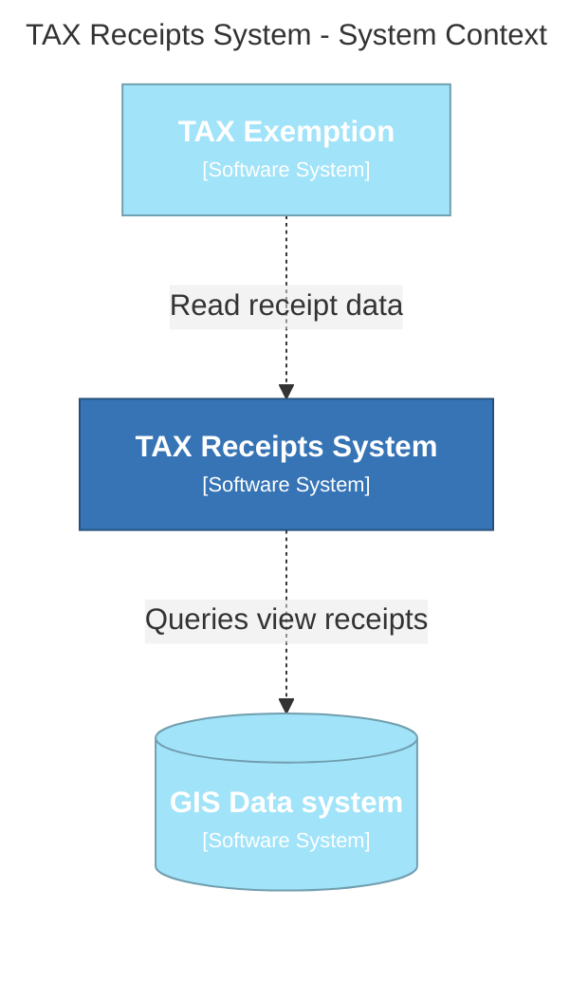
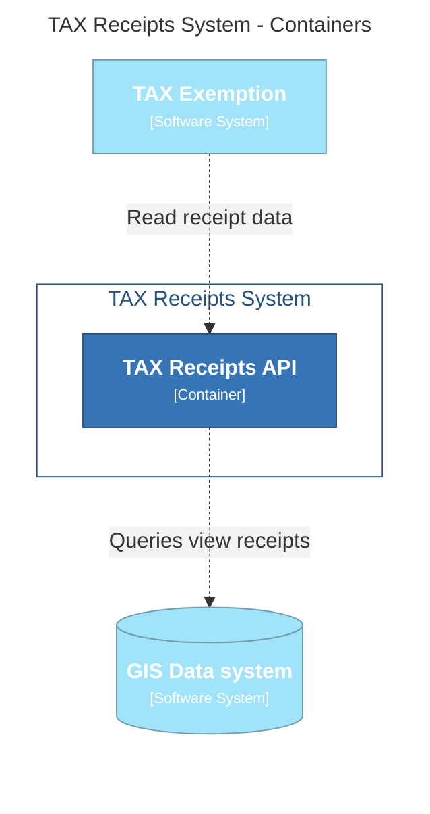
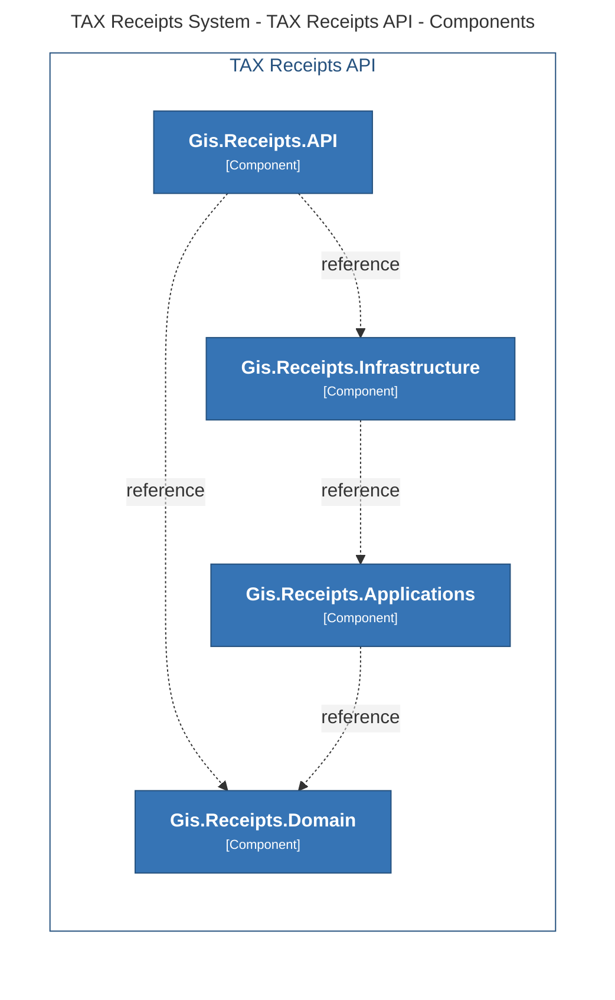

```mermaid
graph LR
  linkStyle default fill:#ffffff

  subgraph diagram ["TAX Receipts System - System Context"]
    style diagram fill:#ffffff,stroke:#ffffff

    1["<div style='font-weight: bold'>TAX Exemption</div><div style='font-size: 70%; margin-top: 0px'>[Software System]</div>"]
    style 1 fill:#a1e3f9,stroke:#709eae,color:#ffffff
    2[("<div style='font-weight: bold'>GIS Data system</div><div style='font-size: 70%; margin-top: 0px'>[Software System]</div>")]
    style 2 fill:#a1e3f9,stroke:#709eae,color:#ffffff
    3["<div style='font-weight: bold'>TAX Receipts System</div><div style='font-size: 70%; margin-top: 0px'>[Software System]</div>"]
    style 3 fill:#3674b5,stroke:#25517e,color:#ffffff

    1-. "<div>Read receipt data</div><div style='font-size: 70%'></div>" .->3
    3-. "<div>Queries view receipts</div><div style='font-size: 70%'></div>" .->2
  end

```

```mermaid
graph LR
  linkStyle default fill:#ffffff

  subgraph diagram ["TAX Receipts System - Containers"]
    style diagram fill:#ffffff,stroke:#ffffff

    1["<div style='font-weight: bold'>TAX Exemption</div><div style='font-size: 70%; margin-top: 0px'>[Software System]</div>"]
    style 1 fill:#a1e3f9,stroke:#709eae,color:#ffffff
    2[("<div style='font-weight: bold'>GIS Data system</div><div style='font-size: 70%; margin-top: 0px'>[Software System]</div>")]
    style 2 fill:#a1e3f9,stroke:#709eae,color:#ffffff

    subgraph 3 ["TAX Receipts System"]
      style 3 fill:#ffffff,stroke:#25517e,color:#25517e

      4["<div style='font-weight: bold'>TAX Receipts API</div><div style='font-size: 70%; margin-top: 0px'>[Container]</div>"]
      style 4 fill:#3674b5,stroke:#25517e,color:#ffffff
    end

    4-. "<div>Queries view receipts</div><div style='font-size: 70%'></div>" .->2
    1-. "<div>Read receipt data</div><div style='font-size: 70%'></div>" .->4
  end
```

```mermaid
graph LR
  linkStyle default fill:#ffffff

  subgraph diagram ["TAX Receipts System - TAX Receipts API - Components"]
    style diagram fill:#ffffff,stroke:#ffffff

    subgraph 4 ["TAX Receipts API"]
      style 4 fill:#ffffff,stroke:#25517e,color:#25517e

      5["<div style='font-weight: bold'>Gis.Receipts.API</div><div style='font-size: 70%; margin-top: 0px'>[Component]</div>"]
      style 5 fill:#3674b5,stroke:#25517e,color:#ffffff
      6["<div style='font-weight: bold'>Gis.Receipts.Infrastructure</div><div style='font-size: 70%; margin-top: 0px'>[Component]</div>"]
      style 6 fill:#3674b5,stroke:#25517e,color:#ffffff
      7["<div style='font-weight: bold'>Gis.Receipts.Applications</div><div style='font-size: 70%; margin-top: 0px'>[Component]</div>"]
      style 7 fill:#3674b5,stroke:#25517e,color:#ffffff
      8["<div style='font-weight: bold'>Gis.Receipts.Domain</div><div style='font-size: 70%; margin-top: 0px'>[Component]</div>"]
      style 8 fill:#3674b5,stroke:#25517e,color:#ffffff
    end

    5-. "<div>reference</div><div style='font-size: 70%'></div>" .->6
    5-. "<div>reference</div><div style='font-size: 70%'></div>" .->8
    6-. "<div>reference</div><div style='font-size: 70%'></div>" .->7
    7-. "<div>reference</div><div style='font-size: 70%'></div>" .->8
  end
```
